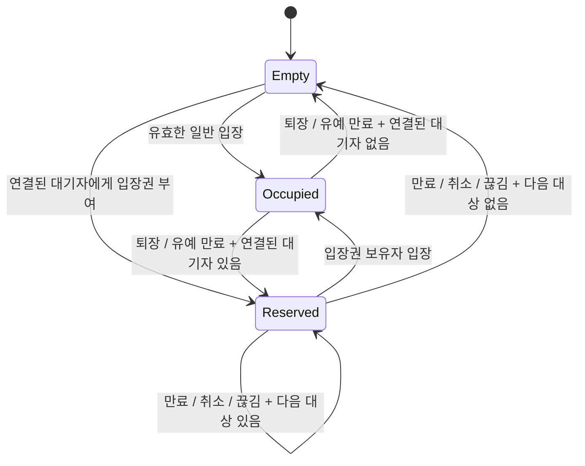
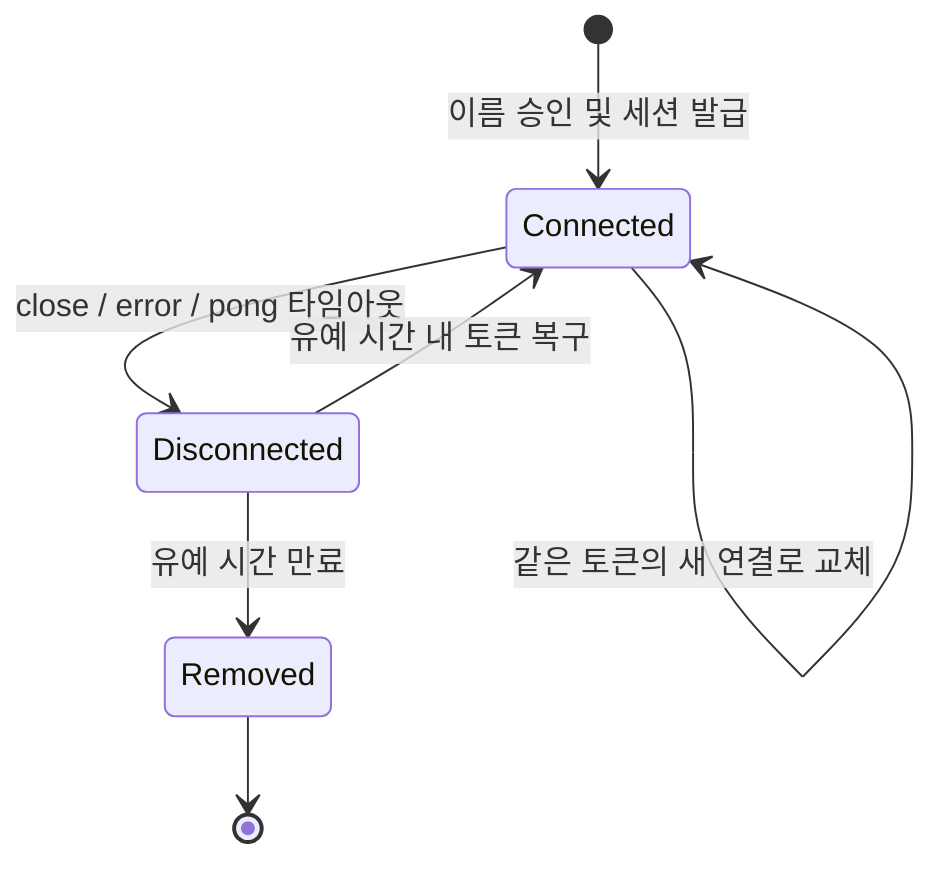

# Open Toilet 서비스 스펙

작성일: 2026-10-01 · 범위: MVP · 구현 전 기준 문서

## 1. 개요 / 목표 / 비목표

접속한 모든 사람이 하나의 공용 1인용 간이 화장실 부스를 공유하는 웹 서비스다. 이름을 입력하고 메인 화면에 들어오면 다른 접속자, 부스 상태, 대기열을 실시간으로 확인한다. 상태 동기화와 액션 전달은 WebSocket을 사용한다.

목표는 **한 번에 한 명만 입장**, **모두에게 같은 상태 표시**, **일시적인 연결 끊김에도 자리 복구**다. 서버가 모든 상태와 권한을 판단하며 클라이언트의 버튼 비활성화는 보조 수단이다.

비목표: 회원가입·로그인, DB 및 영속 저장, 채팅 기록 저장·검색(채팅 자체는 FR-23~25 말풍선으로 제공), 다중 부스·방, 이름 변경, 어드민 없음. 부스 사용 시간 제한과 자리 강제 양도도 MVP에서 제공하지 않는다. 서버 재시작 시 모든 세션과 상태가 초기화된다.

### 기본 결정값

| 항목 | 값 | 기준 |
|---|---|---|
| 이름 | 앞뒤 공백 제거 후 1~12자 | NFC 정규화 후 유니코드 코드 포인트 기준 |
| 하트비트 주기 | 10,000ms | 서버가 애플리케이션 ping 전송 |
| 무응답 타임아웃 | 30,000ms | 마지막 유효 pong 수신 시각 기준 |
| 연결 끊김 유예 시간 | 30,000ms | disconnected 전환 시점부터 |
| 우선 입장 시간 | 10,000ms | 서버가 입장권을 부여한 시점부터 |
| 방귀 쿨다운 | 3,000ms | 세션·액션별 |
| 물 내리기 쿨다운 | 5,000ms | 세션·액션별 |
| 노크 쿨다운 | 3,000ms | 세션·액션별 |
| 자동 재접속 | 500ms부터 지수 백오프, 최대 10,000ms | ±20% 지터, 최종 대기 상한 10,000ms |

## 2. 용어 정리

| 용어 | 의미 |
|---|---|
| 접속자 | 이름 설정을 마친 세션. 유예 시간 내 disconnected 세션도 포함 |
| userId | 서버가 발급하는 공개 식별자. 이름이 같아도 다른 사람으로 구분 |
| sessionToken | 기존 세션을 복구하는 비밀 토큰. 보유자를 같은 사용자로 취급 |
| connected / disconnected | 인증된 활성 소켓이 있음 / 연결이 끊겼지만 유예 시간 내임 |
| 부스 사용자 | 현재 부스를 점유한 userId |
| 대기열 | 입장을 기다리는 userId의 FIFO 목록 |
| 우선 입장권 | 비어 있는 부스에 특정 사용자만 입장할 수 있는 임시 권한 |
| 대기열 맨 앞 | 대기열 배열의 첫 번째 사용자. disconnected도 순번에 포함 |
| 브로드캐스트 | 이름 설정을 마친 활성 연결 전체에 이벤트 전송. 요청자도 포함 |
| 상태 버전 | 공개 상태가 바뀔 때마다 증가하는 revision |

## 3. 화면 명세

### 3.1 이름 입력 화면

- 이름 입력창과 `[입장]` 버튼을 표시한다. 여기서 입장은 **메인 화면 진입**이며 부스 입장과 다르다.
- 이름 검증 실패 시 입력창 아래에 사유를 표시한다. 서버 승인 전에는 메인 화면으로 이동하지 않는다.
- 저장된 토큰이 있으면 먼저 복구를 시도한다. 복구 성공 시 이름 입력을 생략하고, 만료된 토큰이면 삭제 후 이름 입력 화면을 표시한다.
- 이름 입력 후 `[입장]` 클릭 핸들러에서 오디오 unlock을 수행한다. 복구로 진입한 경우 `[소리 켜기]` 버튼을 제공한다.

### 3.2 메인 화면

- 중앙에 부스, 주변에 남자 화장실 입구 픽토그램 형태의 사람 아이콘을 SVG로 배치한다. 각 아이콘 머리 위에 이름을 표시한다.
- 세션당 아이콘은 하나다. 일반 접속자는 주변, 대기자는 줄 위치에 배치하고 부스 사용자는 닫힌 문 뒤에 있는 것으로 표현한다. 공개 접속자 목록에는 모두 표시한다.
- 새 접속자가 늘면 아이콘이 하나씩 늘어난다. 연결 복구는 기존 아이콘을 재사용한다.
- 본인은 `나` 배지로 구분한다. 이름 중복은 허용하고 렌더링 key와 동작 대상에는 userId를 사용한다.
- 접속자 목록에 이름과 연결 상태를 표시한다. disconnected는 흐린 아이콘과 `연결 끊김` 문구로 구분한다. 본인 연결 끊김 시 마지막 상태와 재접속 안내를 표시한다.
- 대기열에는 `순번 + 이름 + 연결 상태`를 표시한다. 우선 입장 대상에게는 별도 배지를 표시한다.
- 사운드 켜기/끄기, 연결 상태, 서버 오류 안내 영역을 제공한다.

### 3.3 부스 상태별 렌더링

| 상태 | 문 / 내부 | 이름표 / 안내 |
|---|---|---|
| 비어 있음, 입장권 없음 | 문 열림, 변기 보임 | `비어 있음` |
| 사용 중 | 문 닫힘 | 부스 위에 사용자 이름. 연결 끊김이면 상태도 표시 |
| 우선 입장 대기 | 문 열림, 변기 보임 | `OO님 우선 입장 · N초`. 부스 점유 이름표와 구분 |

문이 열려 있어도 우선 입장권이 있으면 다른 사람은 들어갈 수 없다. 남은 시간은 서버 시각 보정값으로 표시하되 만료 판단은 서버에 맡긴다.

### 3.4 버튼 활성화 조건

모든 서버 동작 버튼은 세션 복구 및 최신 snapshot 수신이 끝난 connected 상태에서만 활성화한다. 처리 중인 같은 동작은 중복 클릭을 막는다.

| 버튼 | 활성화 조건 |
|---|---|
| 부스 입장 | 부스가 비어 있고, 입장권이 없거나 본인에게 있음 |
| 퇴장 | 본인이 부스 사용자 |
| 줄 서기 | 부스 사용 중, 본인은 부스 밖이며 대기열에 없음 |
| 대기 취소 | 본인이 대기열에 있음. 우선 입장권 보유 중에도 가능 |
| 방귀 | 본인이 부스 사용자이며 방귀 쿨다운 종료 |
| 물 내리기 | 본인이 부스 사용자이며 물 내리기 쿨다운 종료 |
| 문 두드리기 | 부스 사용 중, 본인이 대기열 맨 앞이며 노크 쿨다운 종료 |
| 소리 켜기/끄기 | 메인 화면에서 항상 가능. 로컬 설정 |

## 4. 기능 요구사항

### 이름 / 접속자

| ID | 요구사항 |
|---|---|
| FR-01 | 서버는 이름을 NFC 정규화하고 앞뒤 공백을 제거한 뒤 1~12자로 검증한다. 공백만 있는 이름, 줄바꿈·제어문자·제로폭 문자만으로 된 이름은 거절한다. 내부 공백과 일반 이모지는 허용한다. |
| FR-02 | 이름 중복을 허용한다. 서버가 userId와 추측하기 어려운 sessionToken을 발급한다. 이름은 HTML이 아닌 텍스트로 렌더링한다. |
| FR-03 | 이름 설정 또는 복구에 성공한 접속자만 메인 상태를 받는다. 신규 접속, 연결 상태 변경, 최종 제거를 전체에 브로드캐스트한다. |

### 부스 / 액션

| ID | 요구사항 |
|---|---|
| FR-04 | 부스 점유자는 최대 한 명이다. 서버 처리 큐에 먼저 들어온 유효 입장 요청만 성공한다. 클라이언트 전송 시각은 순서 기준으로 쓰지 않는다. |
| FR-05 | 입장 시 권한을 검증하고 본인 대기열 항목과 입장권을 제거한 뒤 부스를 점유한다. 퇴장은 점유자만 요청할 수 있다. |
| FR-06 | 방귀·물 내리기는 현재 부스 사용자만 실행한다. 허용된 액션을 요청자 포함 전체에 sound 이벤트로 전달한다. |
| FR-07 | 쿨다운은 세션·액션별로 서버에서 관리한다. 방귀 3초, 똥 4초, 물 내리기 5초, 노크 3초다. 똥은 방귀·물 내리기처럼 부스 사용자만 실행할 수 있고, 수신한 모든 클라이언트가 소리와 함께 부스 주변에 갈색 파티클 효과(약 1.8초)를 표시한다. 거절된 요청은 소리를 내지 않고 쿨다운도 연장하지 않는다. |
| FR-08 | 새로고침·재접속·퇴장·재입장으로 쿨다운을 초기화하지 않는다. 각 액션의 쿨다운은 서로 독립적이다. |

### 대기열

| ID | 요구사항 |
|---|---|
| FR-09 | 사용 중인 부스에 대해서만 줄을 설 수 있다. 부스 사용자와 이미 대기 중인 사용자는 참여할 수 없다. |
| FR-10 | 대기열은 서버가 승인한 참여 순서대로 FIFO를 유지한다. 대기 취소는 본인 항목만 제거하며 재참여하면 맨 뒤에 선다. |
| FR-11 | 부스가 사용 중일 때 대기열 맨 앞만 노크할 수 있다. 맨 앞이 disconnected여도 사용 중에는 뒤 사람에게 노크 권한을 넘기지 않는다. |
| FR-12 | 정상·강제 퇴장으로 부스가 비면 connected 대기자 중 가장 앞선 사람에게 10초 우선 입장권을 즉시 부여한다. |
| FR-13 | 입장권을 받으면 대기열에는 입장할 때까지 남는다. 시간 만료·대기 취소·입장권 보유 중 연결 끊김 시 해당 항목과 입장권을 제거하고 다음 대상을 선정한다. 만료된 사용자는 자동으로 줄 끝에 넣지 않는다. |
| FR-14 | 부스가 비었을 때 disconnected 대기자는 순번을 유지하되 입장권 선정에서 건너뛴다. 복구하더라도 이미 발급한 다른 사람의 입장권을 빼앗지 않는다. |
| FR-15 | connected 대기자가 없으면 입장권 없이 누구나 입장할 수 있다. 부스가 비고 입장권도 없는 동안 대기자가 복구하면 즉시 입장권을 선정한다. |

### Presence / 세션

| ID | 요구사항 |
|---|---|
| FR-16 | 서버는 10초마다 JSON ping을 보낸다. 클라이언트는 같은 nonce의 pong으로 응답한다. 마지막 유효 pong 이후 30초가 지나면 소켓을 종료하고 disconnected로 전환한다. |
| FR-17 | 소켓 close/error 감지 시에는 하트비트 타임아웃을 기다리지 않고 즉시 disconnected로 전환한다. 전환 시점부터 30초 유예 시간을 준다. |
| FR-18 | 유예 시간에는 이름·부스 점유·대기열 순번·쿨다운을 유지한다. 단, 입장권 보유 중 끊기면 FR-13을 우선 적용한다. |
| FR-19 | localStorage에 sessionToken을 저장하고 새로고침·재연결 시 복구한다. 유예 시간 내 복구하면 같은 userId, 이름, 자리를 유지하고 connected로 바꾼다. |
| FR-20 | 유예 시간 만료 시 세션과 접속자를 삭제한다. 점유자면 강제 퇴장, 대기자면 대기열에서 제거한 뒤 입장권을 재조정한다. |
| FR-21 | 자동 재접속은 500ms × 2^n에 ±20% 지터를 적용하고 최종 10초로 제한한다. 성공적인 ready와 snapshot 수신 후 횟수를 초기화한다. 대기 중 동작 요청을 저장하거나 재전송하지 않는다. |
| FR-22 | 같은 토큰은 나중에 인증된 연결이 이전 연결을 대체한다. 이전 연결은 SESSION_REPLACED 안내 후 종료하며 자동 재접속을 중단한다. |

### 채팅 / 이름 표시

| ID | 요구사항 |
|---|---|
| FR-23 | 접속자는 메시지를 보내면 본인 캐릭터 머리 위에 말풍선이 뜬다. 부스 안에 있으면 부스 이름표 위에 뜬다. 서버는 현재 연결된 전원(보낸 사람 포함)에게 `chat.message`를 전달하며 메시지를 저장하지 않는다. 늦게 접속한 사람에게 지난 메시지를 재전송하지 않는다. |
| FR-24 | 메시지는 NFC 정규화·앞뒤 공백 제거 후 1~60자, 제어문자 불가. 위반 시 BAD_REQUEST. 사용자별 쿨다운 1초(COOLDOWN). 말풍선은 글자 수에 비례해 5~10초 보이고, 같은 사람의 새 메시지가 오면 교체한다. 텍스트로만 렌더링한다. |
| FR-25 | 인증 전에는 채팅할 수 없다(SESSION_REQUIRED). 연결이 끊긴 사용자는 메시지를 받지 못하고 복구 후에도 재전송하지 않는다. |
| FR-26 | 이름은 길어도 줄임표 없이 전부 표시한다. 부스 이름표는 두 줄(이름 / 입장 경과 시간·상태)로 그려 이름이 길어도 타이머가 가려지지 않는다. |
| FR-27 | 대기열과 접속자 배치는 이름 폭을 기준으로 간격을 정하고, 한 줄에 들어가지 않으면 다음 줄로 내려 이름이 서로 가려지지 않게 한다. |

## 5. 서버 상태 모델 / 상태 전이

### 5.1 싱글 인스턴스 메모리 상태

| 상태 | 주요 필드 | 제약 |
|---|---|---|
| participants | Map<userId, {name, status}> | 유효한 세션마다 하나 |
| sessions | 토큰 조회 키, userId, connectionId, generation, lastPongAt, graceExpiresAt, cooldownUntil | 토큰·연결 정보는 비공개 |
| booth | occupantId 또는 null | occupantId는 participants에 존재 |
| queue | userId 배열 | 중복 없음, 점유자 포함 불가 |
| priority | {userId, expiresAt} 또는 null | 부스가 비어 있을 때만 존재. 대상은 connected이며 queue에 존재 |
| revision | 증가 정수 | 공개 상태 변경 시 증가 |
| serverInstanceId | 서버 시작마다 새 ID | 재시작 전후 revision 구분 |

sessionToken은 암호학적 난수 32바이트 이상으로 만들고 localStorage에 보관한다. URL, 공개 snapshot, 로그에 넣지 않는다. 별도 로그인 수단은 없으므로 토큰을 공유하면 같은 사용자로 취급한다. 저장 실패 시 메모리에 보관하고 새로고침 복구가 불가능함을 안내한다.

모든 명령과 타이머는 하나의 직렬 처리 경로로 들어간다. **기한 처리 → 현재 연결 확인 → 요청 검증 → 상태 변경 → 입장권 조정 → revision 증가 → 응답·브로드캐스트**를 한 작업으로 처리한다. 검증과 변경 사이에 비동기 작업을 끼워 넣지 않는다. 입장권 선정 전에 중간의 비어 있는 상태를 공개하지 않는다.

서버 내부 타임아웃은 단조 시계를 기준으로 계산한다. 페이로드의 시각은 Unix epoch 밀리초다. `now >= expiresAt`이면 만료이며, 타이머 콜백이 늦어져도 요청 처리 전에 기한을 다시 확인한다. 같은 시각에 유예 시간과 입장권이 만료되면 세션 제거를 먼저 처리하고 입장권을 재조정한다.

### 5.2 부스 상태



Empty에는 disconnected 대기자만 남아 있을 수 있다. 연결 끊김 자체는 부스 점유를 해제하지 않는다.

### 5.3 세션 상태



복구·교체 시 connectionId와 generation을 갱신한다. 이전 소켓의 늦은 메시지·close 이벤트, 이전 유예 타이머는 현재 generation과 다르면 무시한다. 연결 교체만으로 disconnected 상태나 자리 해제를 발생시키지 않는다.

## 6. WebSocket 프로토콜

### 6.1 공통 규칙

- 엔드포인트 제안: `/ws`. 운영에서는 WSS를 사용한다. 프로토콜 버전은 `v: 1`이다.
- JSON 텍스트 메시지만 허용한다. 최대 크기는 UTF-8 기준 4KiB다. 바이너리는 종료 코드 1003, 크기 초과는 1009로 종료한다.
- 모든 메시지는 `v`, `type`, `payload`를 가진다. 클라이언트 요청은 고유한 `requestId`를 가진다. 예외는 `heartbeat.pong`이다.
- 소켓 연결 후 5초 안에 `session.open`으로 이름 또는 토큰 중 하나를 제출한다. 인증 전에는 session.open만 허용하며 검증 실패 후에도 최초 5초 제한은 유지한다.
- 서버는 클라이언트가 보낸 userId·이름으로 권한을 판단하지 않는다. 인증된 소켓의 세션을 사용한다.
- 성공한 변경 요청에는 `request.ok`, 실패에는 `request.error`를 보낸다. session.open은 `session.ready`, state.sync는 `state.snapshot`이 성공 응답이다.
- `state.snapshot`은 전체 공개 상태다. 신규 진입·복구·명시적 동기화 및 공개 상태 변경 시 전송한다. MVP는 delta 이벤트를 두지 않는다.
- 같은 연결에서 requestId를 재사용하지 않는다. 서버는 최근 60초·최대 256개의 처리 ID를 보관하고 재사용 시 DUPLICATE_REQUEST로 거절한다. 재접속 후 미확인 요청은 재전송하지 않고 snapshot으로 결과를 확인한다.
- 쿨다운 변경은 요청자에게만 전달하고 공개 revision은 올리지 않는다. 상태 변경의 request.ok에는 변경 후 revision을 담는다.

### 6.2 클라이언트 → 서버 전체 이벤트

| type | payload | 의미 |
|---|---|---|
| session.open | `{name}` 또는 `{sessionToken}` | 신규 세션 / 복구. 둘 중 하나만 허용 |
| state.sync | `{}` | 전체 상태 및 본인 쿨다운 재조회 |
| booth.enter | `{}` | 부스 입장 |
| booth.leave | `{}` | 부스 퇴장 |
| queue.join | `{}` | 대기열 참여 |
| queue.cancel | `{}` | 대기 취소, 본인 입장권도 반납 |
| action.perform | `{action}` | fart / poop / flush / knock |
| chat.send | `{text}` | 채팅 메시지 전송(말풍선) |
| heartbeat.pong | `{nonce}` | 서버 ping에 즉시 응답 |

각 배열 항목은 독립된 WebSocket 메시지 예시다. 배열 자체를 전송하지 않는다.

```json
[
  {"v":1,"type":"session.open","requestId":"r1","payload":{"name":"민수"}},
  {"v":1,"type":"session.open","requestId":"r2","payload":{"sessionToken":"<저장된 비밀 토큰>"}},
  {"v":1,"type":"state.sync","requestId":"r3","payload":{}},
  {"v":1,"type":"booth.enter","requestId":"r4","payload":{}},
  {"v":1,"type":"booth.leave","requestId":"r5","payload":{}},
  {"v":1,"type":"queue.join","requestId":"r6","payload":{}},
  {"v":1,"type":"queue.cancel","requestId":"r7","payload":{}},
  {"v":1,"type":"action.perform","requestId":"r8","payload":{"action":"fart"}},
  {"v":1,"type":"action.perform","requestId":"r9","payload":{"action":"flush"}},
  {"v":1,"type":"action.perform","requestId":"r10","payload":{"action":"knock"}},
  {"v":1,"type":"heartbeat.pong","payload":{"nonce":"hb-42"}}
]
```

### 6.3 서버 → 클라이언트 전체 이벤트

모든 서버 이벤트에는 `serverTime`을 넣는다. 응답 이벤트에는 원래 `requestId`를 넣고 브로드캐스트에는 넣지 않는다.

| type | 전달 대상 | 주요 payload |
|---|---|---|
| session.ready | 인증 요청자 | userId, sessionToken, resumed, serverInstanceId, config |
| state.snapshot | 전체 또는 동기화 요청자 | serverInstanceId, revision, participants, booth, queue, priority, self |
| request.ok | 요청자 | operation, revision, 필요 시 cooldownUntil |
| request.error | 요청자 | code, message, 필요 시 retryAfterMs, cooldownUntil |
| sound.play | 전체, 실행자 포함 | eventId, actorId, action, occurredAt |
| chat.message | 연결된 전체, 보낸 사람 포함 | messageId, userId, text, at |
| heartbeat.ping | 연결별 | nonce |
| session.replaced | 이전 연결 | code, message |

```json
{
  "v":1,
  "type":"session.ready",
  "requestId":"r1",
  "serverTime":1790812800000,
  "payload":{
    "userId":"u_01",
    "sessionToken":"<이 연결에만 전달하는 비밀 토큰>",
    "resumed":false,
    "serverInstanceId":"srv_a",
    "config":{
      "nameMaxLength":12,
      "heartbeatIntervalMs":10000,
      "heartbeatTimeoutMs":30000,
      "gracePeriodMs":30000,
      "priorityWindowMs":10000,
      "cooldownsMs":{"fart":3000,"flush":5000,"knock":3000}
    }
  }
}
```

ready 직후 반드시 snapshot을 보낸다. snapshot의 self는 수신자마다 다르며 타인의 쿨다운·토큰은 포함하지 않는다. queue 배열 인덱스 + 1이 순번이다.

```json
{
  "v":1,
  "type":"state.snapshot",
  "serverTime":1790812800000,
  "payload":{
    "serverInstanceId":"srv_a",
    "revision":21,
    "participants":[
      {"userId":"u_01","name":"민수","status":"connected","graceExpiresAt":null},
      {"userId":"u_02","name":"민수","status":"disconnected","graceExpiresAt":1790812825000},
      {"userId":"u_03","name":"지수","status":"connected","graceExpiresAt":null}
    ],
    "booth":{"occupantId":null},
    "queue":["u_02","u_03"],
    "priority":{"userId":"u_03","expiresAt":1790812810000},
    "self":{"userId":"u_01","cooldownUntil":{"fart":0,"flush":0,"knock":0}}
  }
}
```

booth.occupantId가 있으면 priority는 null이다. revision은 같은 서버 인스턴스 안에서만 비교한다. 이전 revision의 공개 상태는 적용하지 않으며 동일 revision의 동기화 응답은 self 갱신에 사용할 수 있다.

```json
[
  {"v":1,"type":"request.ok","requestId":"r8","serverTime":1790812800000,"payload":{"operation":"action.perform","revision":22,"cooldownUntil":{"fart":1790812803000}}},
  {"v":1,"type":"request.error","requestId":"r9","serverTime":1790812801000,"payload":{"code":"COOLDOWN","message":"잠시 후 다시 시도해 주세요.","retryAfterMs":2000,"cooldownUntil":1790812803000}},
  {"v":1,"type":"sound.play","serverTime":1790812800000,"payload":{"eventId":"snd_01","actorId":"u_01","action":"fart","occurredAt":1790812800000}},
  {"v":1,"type":"heartbeat.ping","serverTime":1790812810000,"payload":{"nonce":"hb-42"}},
  {"v":1,"type":"session.replaced","serverTime":1790812820000,"payload":{"code":"SESSION_REPLACED","message":"다른 탭에서 연결했습니다."}}
]
```

위 응답은 형식 예시이며 하나의 연속 시나리오를 뜻하지 않는다. JSON 파싱 실패처럼 requestId를 얻을 수 없으면 request.error에서 requestId를 생략한다.

### 6.4 에러 코드

| 코드 | 조건 | 클라이언트 처리 |
|---|---|---|
| NAME_INVALID | 이름 형식·길이 오류 | 이름 입력 오류 표시 |
| SESSION_INVALID | 알 수 없거나 유예 시간이 만료된 토큰 | 토큰 삭제, 이름 입력으로 이동 |
| SESSION_REQUIRED | 인증 전 동작 요청 | 인증 진행 |
| SESSION_ALREADY_OPEN | 인증된 소켓에서 다시 session.open | 재요청 중단 |
| SESSION_REPLACED | 새 연결이 기존 연결 대체 | 이전 탭 동작·재접속 중단 |
| BOOTH_OCCUPIED | 이미 다른 사람이 점유 | 최신 상태 확인 |
| ALREADY_IN_BOOTH | 점유자가 다시 입장하거나 줄 서기 | 해당 동작 비활성화 |
| BOOTH_RESERVED | 타인의 우선 입장 시간 | 대상·남은 시간 안내 |
| BOOTH_EMPTY | 비어 있을 때 줄 서기 또는 노크 | 동작 비활성화 |
| NOT_IN_BOOTH | 점유자가 아닌 사람의 퇴장·방귀·물 내리기 | 권한 안내 |
| ALREADY_IN_QUEUE | 중복 대기열 참여 | 기존 순번 표시 |
| NOT_IN_QUEUE | 대기하지 않는 사람의 취소 | 상태 동기화 |
| NOT_QUEUE_HEAD | 대기열 맨 앞이 아닌 사람의 노크 | 노크 비활성화 |
| COOLDOWN | 해당 액션 쿨다운 중 | 서버 종료 시각까지 비활성화 |
| DUPLICATE_REQUEST | 동일 연결에서 처리 ID 재사용 | 재전송 중단, 필요 시 동기화 |
| BAD_REQUEST | JSON·필드·액션 값 오류 | 오류 안내, 자동 반복 금지 |
| UNKNOWN_EVENT | 지원하지 않는 type | 오류 기록 |
| UNSUPPORTED_VERSION | v 불일치 | 새로고침 안내, 1002 종료 |
| AUTH_TIMEOUT | 연결 후 5초 안에 인증 미완료 | 4001 종료, 재접속 시 인증 |
| RATE_LIMITED | 소켓당 초당 요청 20개 초과 | retryAfterMs 동안 요청 중단 |
| INTERNAL_ERROR | 예상하지 못한 처리 실패 | 오류 안내 후 state.sync |

상태 오류가 겹치면 인증·형식 → 부스 점유/입장권 → 대기열 권한 → 쿨다운 순으로 검증한다. booth.enter는 본인 점유를 ALREADY_IN_BOOTH로, 타인 점유를 BOOTH_OCCUPIED로 응답한다. 오류 응답은 상태를 변경하지 않는다.

### 6.5 하트비트 / 재접속 상세

- 브라우저에서 명시적으로 처리할 수 있도록 JSON ping/pong을 사용한다. WebSocket 제어 프레임 ping/pong과 별개다.
- 인증 완료 시 lastPongAt을 현재 시각으로 초기화한다. 발급한 nonce에 대한 미처리 pong만 인정하고 재사용·알 수 없는 nonce는 무시한다. 일반 요청은 pong을 대신하지 않는다.
- 하트비트 메시지는 요청 제한에 포함하지 않는다. 서버는 최소 1초 간격으로 무응답 기한을 검사한다.
- 클라이언트도 서버 메시지가 30초 동안 없으면 기존 소켓을 닫고 재접속한다. 서버 타이머가 자리 유지 여부의 최종 기준이다.
- 통신이 조용히 끊기면 감지까지 최대 약 30초, 이후 유예 30초로 총 약 60초간 자리가 남을 수 있다. close를 즉시 감지한 경우 약 30초다.
- 오프라인이면 재시도 타이머를 멈추고 online 이벤트에서 재시도한다. 대기 타이머와 연결 시도는 각각 하나만 유지한다. 화면 복귀 시 연결 확인과 state.sync를 수행한다.
- 복구 성공 시 토큰은 유지한다. 유예 시간 만료·서버 재시작으로 SESSION_INVALID를 받으면 새 이름 입력이 필요하다.
- 교체된 소켓은 안내 후 4009로 종료한다. 이전 탭은 명시적인 `[이 탭에서 다시 연결]` 클릭 전까지 재접속하지 않는다. 안내 이벤트를 놓쳐도 종료 코드로 같은 정책을 적용한다.

## 7. 엣지 케이스 / 예외 처리

| 상황 | 서버 정책 / 기대 결과 |
|---|---|
| 두 사람이 동시에 입장 | 먼저 처리된 유효 요청만 성공. 나머지는 BOOTH_OCCUPIED |
| 퇴장 직후 외부인이 입장 시도 | 퇴장과 입장권 선정을 원자적으로 처리. 입장권이 있으면 BOOTH_RESERVED |
| 부스 안에서 연결 끊김 | 문은 닫힌 채 이름과 연결 끊김 표시. 유예 만료 시 강제 퇴장 |
| 일반 접속자 연결 끊김 | 유예 동안 아이콘 유지, 만료 후 제거 |
| 대기자 연결 끊김 | 순번 유지. 입장권 선정 시 건너뛰고 유예 만료 시 제거 |
| 입장권 보유자가 연결 끊김 | 입장권·대기열 항목 즉시 제거. 세션은 유예 동안 유지 |
| 끊긴 맨 앞을 건너뛴 후 복구 | 원래 순번 유지. 현재 발급된 입장권은 유지하고 다음 선정 때 고려 |
| 모든 대기자가 disconnected | 대기열은 유지하되 입장권 없음. 누구나 입장 가능 |
| 우선 입장 시간 만료 | 해당 대기자를 줄에서 제외하고 다음 connected 대기자에게 새 10초 부여 |
| 만료 시각과 입장 요청이 겹침 | now가 기한 이상이면 먼저 만료 처리. 이후 일반 입장 조건으로 검증 |
| 대기 취소와 입장 동시 요청 | 서버 처리 순서대로 검증. 입장 후 취소는 NOT_IN_QUEUE |
| 새로고침 | 토큰으로 복구. 기존 자리·쿨다운 유지, 지난 소리는 재생하지 않음 |
| 동일 토큰으로 여러 탭 | 나중 인증된 연결만 활성. 이전 소켓의 이벤트가 새 연결을 끊지 않도록 generation 확인 |
| 이름 중복 | 모두 허용. userId로 구분, 본인 배지 표시 |
| 액션 연속 클릭 / 직접 메시지 조작 | 서버 권한·쿨다운 검증. 거절 요청은 브로드캐스트 없음 |
| 액션 성공 응답 전에 연결 끊김 | 자동 재전송하지 않음. 복구 snapshot의 쿨다운으로 UI 갱신 |
| 백그라운드 탭 절전 | 하트비트 지연 시 동일한 끊김 정책 적용. 백그라운드라는 이유로 자리 무기한 보장 안 함 |
| localStorage 토큰 삭제 | 새 세션으로 진입. 이전 세션은 기존 연결 또는 유예 정책을 따름 |
| 서버 재시작 | 상태·토큰 초기화. 클라이언트가 새 이름 입력 후 재진입 |
| 소리 파일 실패 / 오디오 차단 | 상태 처리 유지. 소리 켜기 또는 재시도 안내, 지난 소리 재생 안 함 |
| 느린 연결로 송신 버퍼 누적 | 연결당 대기 송신량 1MiB 초과 시 종료하고 유예 적용. 복구 후 전체 snapshot 수신 |

## 8. 사운드 명세

| 액션 | 권한 | 기본 파일 경로 | 권장 길이 |
|---|---|---|---|
| fart | 부스 사용자 | `/sounds/fart.mp3` | 1~2초 |
| poop | 부스 사용자 | `/sounds/poop.mp3` | 1~1.5초 |
| flush | 부스 사용자 | `/sounds/flush.mp3` | 3~4초 |
| knock | 사용 중인 부스의 대기열 맨 앞 | `/sounds/knock.mp3` | 1초 내외 |

- 기본 포맷은 MP3, 필요 시 동일 이름의 OGG를 추가한다. 재배포 가능한 라이선스의 파일을 사용하고 음량 편차를 줄인다.
- 이름 화면의 `[입장]` 클릭 안에서 AudioContext 생성·resume 등 unlock을 시도한다. 네트워크 응답을 기다린 뒤 unlock하지 않는다.
- 자동 복구는 사용자 제스처가 아니므로 오디오가 잠겨 있으면 `[소리 켜기]`를 표시한다. 재생 Promise 실패도 처리한다.
- 실제 재생은 서버의 sound.play 수신 때만 한다. 클릭 직후 선재생하지 않아 실행자에게 두 번 들리지 않게 한다.
- 현재 연결된 전체 사용자에게 동일 이벤트를 전달한다. 음소거·오디오 잠금·파일 실패 시 실제 재생은 생략할 수 있다. disconnected 사용자에게 소리를 보관하거나 재전송하지 않는다.
- eventId를 최근 60초·최대 256개 보관해 중복 재생을 막는다. 서버 시각 보정 기준 2초보다 오래된 이벤트는 버린다.
- 서로 다른 액션의 소리는 겹쳐 재생할 수 있다. 최대 4개까지 동시 재생하며 초과 시 가장 오래된 소리를 중단한다.
- 음소거는 사용자 로컬 설정으로 저장하고 서버 액션 권한에는 영향을 주지 않는다. 소리를 끈 사용자도 짧은 액션 텍스트 표시로 상황을 알 수 있게 한다.

## 9. 비기능 요구사항

| 항목 | 목표 / 전제 |
|---|---|
| 처리 지연 | 동시 활성 연결 100개, 국내 RTT 100ms 이하 환경에서 요청→상태 화면 반영 p95 300ms 이하 |
| 사운드 지연 | unlock·사전 로드 완료 조건에서 액션 요청→재생 시작 p95 500ms 이하. 장치 간 샘플 단위 동기화는 범위 밖 |
| 상태 일관성 | 부스 중복 점유 0건. 클라이언트는 서버 상태를 그대로 반영 |
| 배포 | Node.js 프로세스 하나, 싱글 인스턴스. 여러 worker·복제본 사용 안 함 |
| 저장 | 상태는 메모리에만 보관. 세션 최종 제거 시 토큰·쿨다운·타이머도 정리 |
| 입력 보호 | JSON 스키마 검증, 크기 제한, 요청 제한, 이름 텍스트 렌더링 |
| 연결 보호 | 운영 WSS, 허용 Origin 검증. 토큰 로그 마스킹, 클라이언트 번들에 비밀값 없음 |
| 접근성 | 버튼 키보드 조작, 입력 label, SVG 대체 설명, 색상 외 텍스트로 상태 구분 |
| 관측 | 접속/복구/만료/입장/퇴장/오류·처리 지연 기록. 토큰과 불필요한 이름은 로그에서 제외 |

전체 snapshot 브로드캐스트는 변경당 접속자 수에 비례해 송신하고, 각 snapshot 크기도 접속자 수에 따라 커진다. 100명은 검증 목표이며 최대 수용 인원 보장은 아니다.

스케일 아웃하면 프로세스별로 부스·대기열이 갈라진다. sticky session만으로는 해결되지 않는다. 공통 상태 저장소, 원자적인 점유·입장권 처리, 브로드캐스트 채널, 단일 타이머 소유권을 별도 설계해야 한다.

## 10. 기술 스택 / 디렉터리 구조 제안

버전은 구현 착수 시 호환되는 안정 버전으로 고정한다. 이 문서는 패키지 설치나 코드 생성을 포함하지 않는다.

| 영역 | 제안 | 사용 목적 |
|---|---|---|
| 프론트엔드 | React + TypeScript + Vite | 화면 상태와 WebSocket 연결 관리 |
| 렌더링 | SVG + CSS | 부스 문·변기·사람 픽토그램, 반응형 배치 |
| 사운드 | Web Audio API | unlock, 중첩 재생, 음소거 |
| 서버 | Node.js + TypeScript + ws | WebSocket, 메모리 상태, 타이머 |
| 프로토콜 | 공통 TypeScript 타입 + 런타임 스키마 검증 | 이벤트·페이로드 일치 및 입력 검증 |
| 검증 | 상태 전이 단위 테스트 + 실제 WebSocket 통합 테스트 | 동시성 이슈와 타이머 경계 검증 |

아래는 향후 구현 구조 제안이며 지금 생성할 파일은 SPEC.md 하나다.

```text
open-toilet/
├─ SPEC.md
├─ apps/
│  ├─ web/
│  │  ├─ public/sounds/          # fart.mp3, flush.mp3, knock.mp3
│  │  └─ src/
│  │     ├─ components/         # 이름 입력, 부스, 접속자, 대기열
│  │     ├─ connection/         # 세션, 재접속, 하트비트
│  │     ├─ audio/              # unlock, 재생, 음소거
│  │     └─ state/              # snapshot, 본인 쿨다운
│  └─ server/src/
│     ├─ transport/            # ws 연결, 인증, 메시지 검증
│     ├─ domain/               # 부스·대기열·입장권 상태 전이
│     ├─ presence/             # 세션, 하트비트, 유예 타이머
│     └─ timers/               # 기한 처리
├─ packages/protocol/          # 공통 이벤트 타입·스키마
└─ tests/                      # 상태 전이, WebSocket 통합 테스트
```

## 11. 마일스톤 / 수동 테스트 체크리스트

| 단계 | 범위 | 완료 기준 |
|---|---|---|
| 1. 서버 | 세션, 직렬 상태 처리, 부스, FIFO, 입장권, 쿨다운, 하트비트 | 다중 클라이언트로 경쟁 요청·복구·만료를 검증 |
| 2. 프론트 | 이름 입력, SVG 부스·사람, 접속 상태, 대기열, 버튼, 재접속 | 서로 다른 브라우저에서 동일 상태 확인 |
| 3. 사운드 / 폴리싱 | 오디오 unlock, 3종 효과음, 음소거, 접근성, 오류 안내 | 모바일·데스크톱에서 재생 정책과 주요 흐름 검증 |

수동 검증은 서로 다른 프로필 3개 이상을 사용한다. 같은 프로필의 탭은 토큰을 공유하므로 독립 사용자 테스트와 다중 탭 테스트를 구분한다.

- [ ] 빈 이름·공백만 있는 이름·13자 이름은 거절되고, 한글·이모지·중복 이름은 정의된 길이 규칙대로 처리된다.
- [ ] 이름 승인 전 메인 화면에 진입하지 않으며 접속자 증가에 따라 사람 아이콘이 늘어난다.
- [ ] 두 사용자가 동시에 입장해도 한 명만 성공한다. 문·변기·이름표가 모든 화면에서 일치한다.
- [ ] 부스 밖에서 방귀·물 내리기를 직접 요청하면 거절된다.
- [ ] 방귀 3초·물 내리기 5초·노크 3초 안의 반복 요청은 소리를 추가로 내지 않는다.
- [ ] 비어 있을 때 줄 서기가 비활성화되고 직접 요청도 거절된다.
- [ ] 점유자의 줄 서기·중복 참여가 거절되고 대기 취소·재참여는 FIFO를 따른다.
- [ ] 맨 앞만 노크 가능하며 본인 포함 다른 브라우저에서도 소리가 한 번씩 난다.
- [ ] 퇴장 직후 첫 연결 대기자에게 10초 입장권이 생기며 다른 사용자는 입장할 수 없다.
- [ ] 입장권 만료·취소 후 다음 사람에게 새 10초가 주어지고, 마지막 대상까지 끝나면 일반 입장이 가능하다.
- [ ] 부스 점유자·대기자·일반 접속자 각각 연결을 끊으면 상태가 표시되고, 유예 내 복구하면 동일 세션을 유지한다.
- [ ] 유예 30초를 넘기면 역할별로 정리되고 부스 강제 퇴장 후 입장권 선정이 실행된다.
- [ ] 소켓 종료 감지와 네트워크 블랙홀을 구분해 각각 즉시 감지·30초 무응답 감지를 확인한다.
- [ ] 끊긴 대기자를 건너뛰어 입장권을 주며, 복구한 사용자가 이미 발급된 입장권을 빼앗지 않는다.
- [ ] 입장권 보유 중 끊기면 즉시 다음 사람으로 넘어가며 복구해도 이전 입장권은 돌아오지 않는다.
- [ ] 동일 토큰의 새 탭이 이전 탭을 대체하고, 이전 탭이 자동 재접속 루프를 만들지 않는다.
- [ ] 새로고침 후 점유·순번·쿨다운이 유지된다. 소리는 재연결 후 몰아서 재생되지 않는다.
- [ ] 서버 재시작 후 기존 토큰은 무효가 되고 이름 입력부터 다시 진행한다.
- [ ] 오디오 차단·음소거·파일 로드 실패 시에도 부스와 대기열이 정상 동작한다.
- [ ] 입장권·유예 만료 경계에서 요청이 들어와도 만료된 권한으로 처리되지 않는다.

## 12. 오픈 이슈

핵심 동작과 시간값은 위 기준으로 확정한다. 아래 항목은 구현·출시 준비 단계에서 결정한다.

| 항목 | 현재 기준 | 결정할 내용 |
|---|---|---|
| 디자인·사운드 자산 | SVG 픽토그램, MP3 3종 | 구체적인 디자인과 사용 가능한 음원 라이선스 |
| 배포 환경 | WSS를 지원하는 싱글 인스턴스 | 호스팅, 도메인, 프록시 idle timeout 설정 |
| 수용 인원 | 활성 연결 100명 성능 검증 | 실제 부하 측정 후 운영 상한·초과 접속 안내 |
| 장기 점유·악용 | 사용 시간 제한 없음, 어드민 없음 | 필요 시 최대 점유 시간·신규 세션 발급 제한을 별도 요구사항으로 추가 |
| 브라우저 지원 범위 | 모바일·데스크톱의 주요 브라우저 검증 | 출시 시점의 구체적인 지원 버전과 iOS 오디오 동작 확인 |
